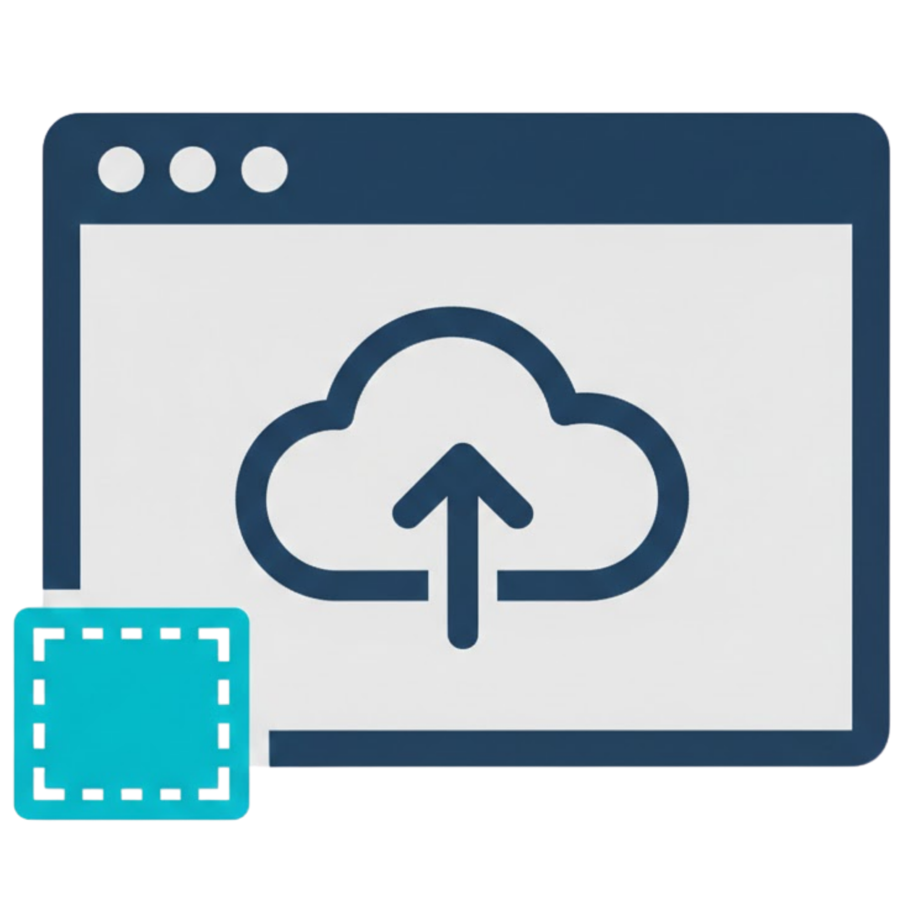
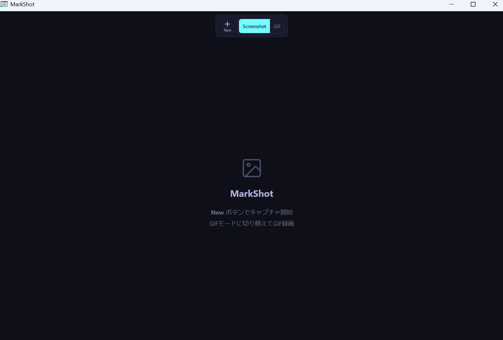
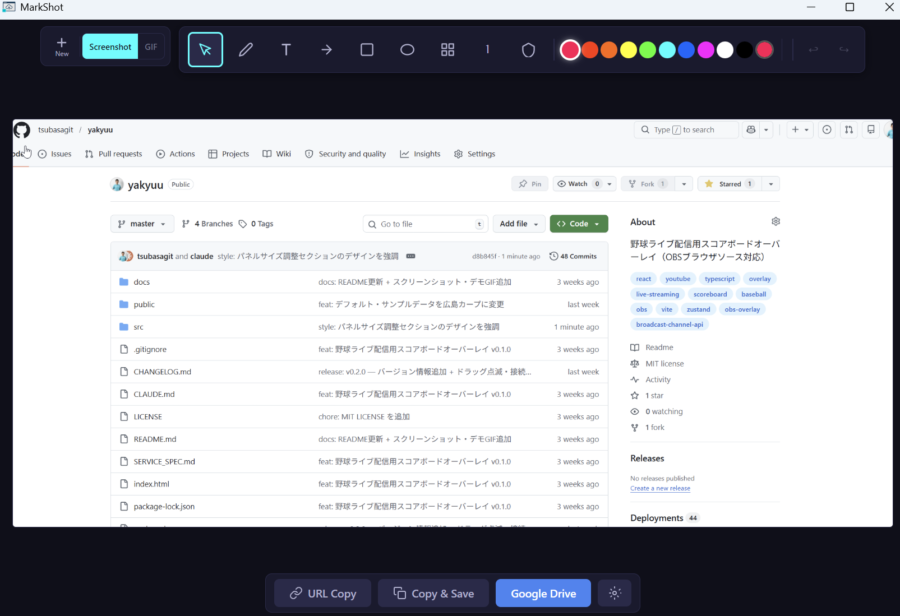

# MarkShot


> 撮って、書いて、共有する。 — Windows向けスクリーンショット＆注釈ツール

<p align="center">
  
</p>

<p align="center">
  
</p>

## 機能

### キャプチャ
- 画面の任意の領域を選択してキャプチャ
- 動画録画（WebM形式）
- GIF録画（最大30秒）
- マルチディスプレイ対応

### 注釈ツール
- ペン（フリーハンド描画）
- テキスト挿入
- 矢印
- 四角形・楕円
- モザイク（個人情報などのぼかし）
- ステップ番号（手順説明用の連番マーカー）
- バッジ（OK / NG / WARN / INFO / BUG）
- 12色カラーパレット + サイズ調整

### 保存・共有
- クリップボードにコピー
- ローカルフォルダへ自動保存
- Google Drive へワンクリックアップロード

### システム連携
- システムトレイ常駐
- グローバルショートカット（Ctrl+Shift+S）
- トレイダブルクリックで即キャプチャ

<p align="center">
  
</p>

## インストール

[Releases](https://github.com/tsubasagit/MarkShot/releases) から `MarkShot-Setup-1.1.0.exe` をダウンロードして実行してください。

## 開発

### 必要環境
- Node.js 18+
- npm

### セットアップ
```bash
git clone https://github.com/tsubasagit/MarkShot.git
cd MarkShot
npm install
```

### 開発サーバー起動
```bash
npm run dev
```

### ビルド（exe生成）
```bash
npm run build
```

## 技術スタック

- Electron 28
- React 18
- TypeScript
- Konva（Canvas描画）
- Vite
- electron-builder（パッケージング）

## 既知の制限（Windows）

- **2回目以降のキャプチャでエディタの残像が出ることがあります**（Windowsの画面キャプチャの仕様に起因）。キャプチャ後、エディタは自動で表示されません。トレイメニュー「ウィンドウを表示」で編集できます。2回目を撮る場合は、1回目でウィンドウを開かずにそのままトレイから再度キャプチャすると残像が出にくくなります。

## ライセンス

[MIT](LICENSE)

## 作成者

宮崎翼
