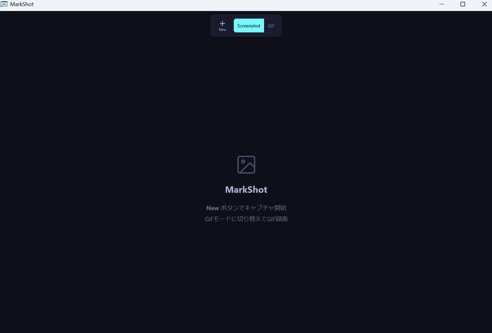
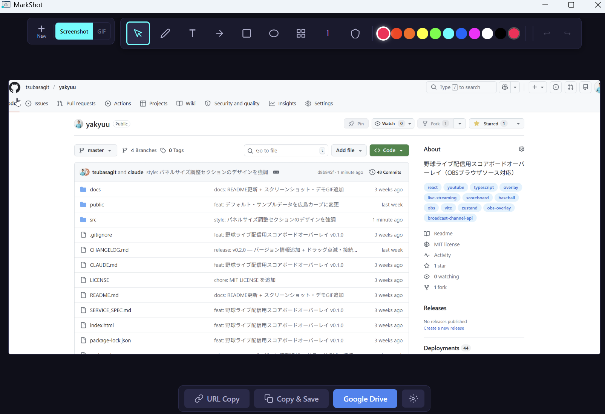

# MarkShot


> 撮って、書いて、貼るだけ。— インストール **5.79MB**、メモリ **25MB** の超軽量スクリーンショットツール。

<p align="center">
  
</p>

<p align="center">
  
</p>

## なぜ v2 か — Tauri 化で 98% 軽くなりました

| | v1.4.0 (Electron) | **v2.0.0 (Tauri)** | 削減 |
|---|---:|---:|---:|
| インストールサイズ | 259.23 MB | **5.79 MB** | **-97.8%** |
| ワーキングセット | 290.61 MB | **25.45 MB** | **-91.2%** |
| プライベートメモリ | 180.86 MB | **4.52 MB** | **-97.5%** |
| プロセス数 | 4 | **1** | **-75%** |
| 起動時間 | 418 ms | 644 ms | +226 ms |

計測条件: Surface Laptop 7 (Windows 11 ARM64 / 16GB) / release build / ウィンドウ表示後 5 秒安定化。

Windows 付属の Snipping Tool（~30MB）より軽く、Electron 時代の "重い" を完全に脱ぎました。

## 機能

### キャプチャ
- 画面の任意の領域を選択してキャプチャ
- グローバルショートカット（既定 `Ctrl+Shift+S`、変更可）
- マルチディスプレイ対応

### 注釈ツール（5種類）
- 矢印
- テキスト
- 枠（矩形）
- ペン（自由描画）
- モザイク（半透明の目隠し）
- 色 5 色 / 太さ 3 段
- 選択ツールでドラッグ移動、Delete で削除
- Undo / Redo

### 保存
- クリップボードにコピー（Ctrl+V でそのまま貼り付け可）
- ローカルフォルダへ保存（既定 `Pictures/MarkShot/`、任意フォルダ指定可）

### 設定
- ショートカットカスタマイズ
- クリップボードコピー on/off
- 自動保存 on/off + 保存先フォルダ
- 設定は `%APPDATA%\com.markshot.app\settings.json` に永続化

<p align="center">
  
</p>

## インストール

[Releases](https://github.com/tsubasagit/MarkShot/releases) から最新の `MarkShot_2.0.0_arm64-setup.exe` をダウンロードして実行してください。

> v2 は **Windows 11 ARM64** ビルドを配布します（Surface Laptop 7 等）。x64 ビルドが必要な場合は Issue でリクエストしてください。

## 開発

### 必要環境
- Node.js 18+
- Rust (stable, MSVC target)
- WebView2 Runtime（Windows 10 に標準搭載、11 ではさらに最新）

### セットアップ
```cmd
git clone https://github.com/tsubasagit/MarkShot.git
cd MarkShot
npm install
```

### 開発サーバー起動
```cmd
npm run dev
```

### リリースビルド
```cmd
npm run build
```
`src-tauri\target\release\bundle\nsis\` に NSIS インストーラが生成されます。

## 技術スタック

- **Tauri 2** — ネイティブ WebView2 採用、Electron 比 -98% のバイナリ
- **React 18** + **TypeScript** — UI
- **Konva** + **react-konva** — 注釈エディタの Canvas 描画
- **Rust** — スクリーンキャプチャ / クリップボード / ファイル I/O
- **Vite** — フロントエンドビルド

## バージョン履歴

- **v2.0.0** — Tauri 全面書き直し。メモリ 91%・インストール 98% 削減。Google Drive 連携 / GIF 録画 / 動画録画 / ステップ番号 / バッジ / 楕円 / 12 色パレットは「超シンプル路線」として廃止
- **v1.x** — Electron ベース（凍結）

## ライセンス

[MIT](LICENSE)

## 作成者

宮崎翼 / [AppTalentHub](https://apptalenthub.co.jp)
